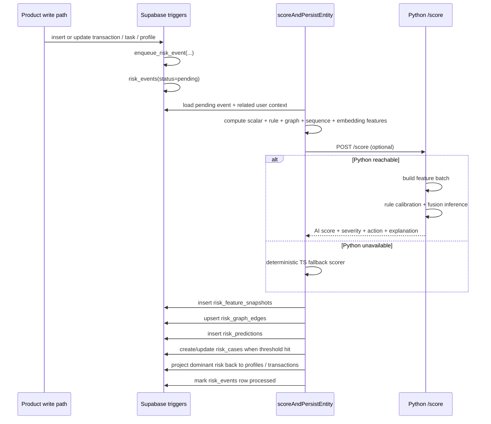
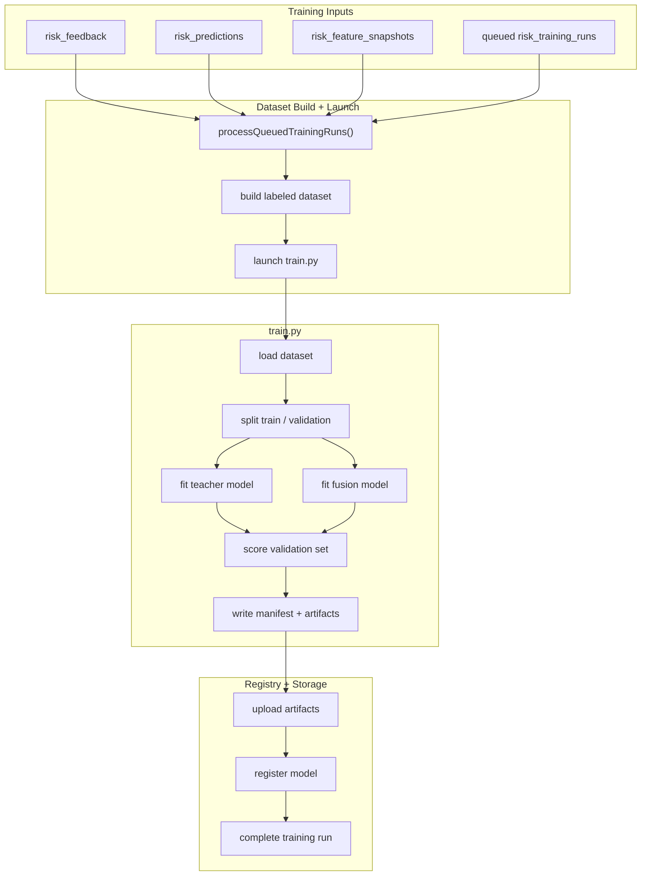
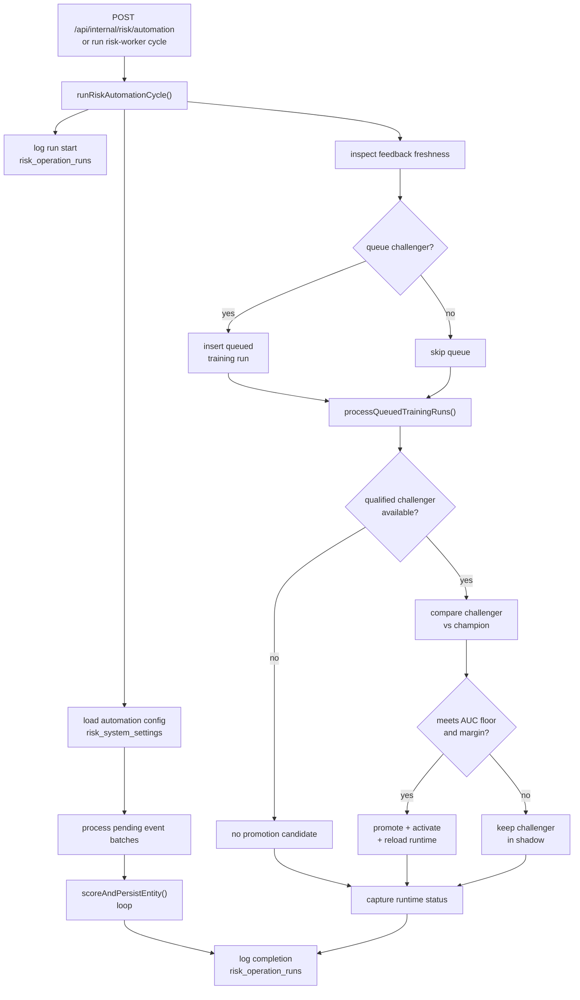
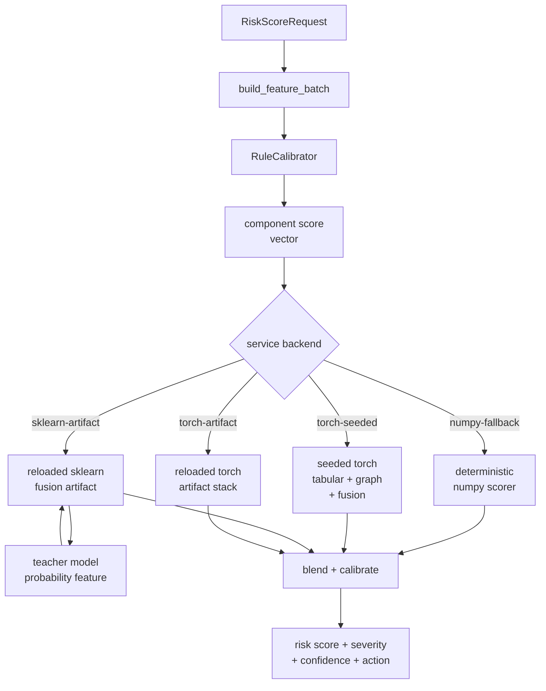

# Advanced AI Risk Engine

## What This Update Brings

This pull request adds new highly advanced backend AI capabilities to the platform: a continuously learning AI risk engine that can watch platform activity, score it in real time, surface the highest-risk patterns, and improve as more decisions and feedback accumulate.

With this PR, the platform gains:

- event-driven AI scoring
- engineered risk features derived from live platform behavior
- graph-aware relationship detection
- persistent prediction history and reviewable risk cases
- model training and validation
- artifact storage and live model activation
- a challenger/champion loop for continuous improvement

In other words, the app moves from static backend logic into a system that can actually accumulate intelligence over time.

## Key AI Components

Under the hood, the stack combines multiple AI layers instead of relying on a single weak scorer:

- a gradient-boosted teacher model for strong tabular supervision
- a differentiable tabular encoder
- a differentiable graph-signal encoder
- a fusion risk head that learns from engineered features, model latents, and component scores together
- an automated challenger/champion promotion loop
- backpropagation through the differentiable lower-level paths while the boosted-tree teacher contributes supervisory probability targets

The result is a backend AI system that feels far closer to a state-of-the-art production ML stack than a simple rules engine.

## The AI Layer In Plain English

Every time important platform activity happens, the new backend can:

1. capture the event automatically
2. build a richer feature set around it
3. score it with an AI-backed risk pipeline
4. save the prediction and supporting signals
5. open a risk case when the event crosses a threshold
6. learn from later analyst decisions so future models get better

That gives the backend a real AI loop:

- observe
- score
- store
- review
- retrain
- promote better models

## End-to-End Inference Flow

This is the live scoring path that turns ordinary platform events into AI-backed risk intelligence.



## Training, Validation, and Registry Flow

This PR does not stop at inference. It also adds the model lifecycle needed to make the system automatically improve over time.

Feedback, predictions, and engineered features are assembled into a labeled dataset, trained into challengers, validated, stored, and registered as deployable models.



## Continuous Learning And Auto-Promotion

The most powerful aspect of this AI system is that it is designed to continuously keep getting smarter.

The backend now supports:

- automatic review of fresh analyst feedback
- challenger model queueing
- challenger training
- validation-aware comparison against the current champion
- automatic promotion only when the challenger actually wins by the configured rules

That means the AI layer is designed to improve itself over time without reckless deployment.



## Runtime Serving Modes

The runtime was built to be both advanced and resilient.

If the full ML runtime is available, the backend can use richer model-backed inference. If it is not, the platform still has a deterministic fallback path instead of breaking.

That makes the AI layer practical in real deployment, not just impressive on paper.



## What Is Actually Included In This PR

Backend functionality added in this PR includes:

- new risk tables, event capture, case storage, feedback storage, model registry, training runs, and operation logs
- TypeScript feature engineering and scoring runtime
- Python AI inference service
- Python training pipeline
- artifact persistence and activation
- admin/internal APIs for rescoring, training, promotion, runtime status, and automation cycles
- server-side risk-aware enforcement hooks

Importantly, all of this lands as infrastructure, so it supercharges the platform's AI capabilities without altering the frontend interface, so you can decide to incorporate it however you want.

## Core Model Equations

At a simplified level, the fused risk head can be written as:

$$
z = W_f x_f + W_t h_t + W_g h_g + W_c c + b
$$

$$
\hat{p}_{risk} = \sigma(z)
$$

Where:

- $x_f$ is the engineered fused feature vector
- $h_t$ is the tabular latent produced by the differentiable tabular encoder
- $h_g$ is the graph latent produced by the graph-signal encoder
- $c$ is the calibrated component-score bundle
- $\sigma(\cdot)$ is the logistic link for the final risk probability

The boosted-tree teacher behaves like:

$$
f_{teacher}(x) = \sum_{m=1}^{M} \eta \, T_m(x)
$$

where each $T_m$ is a learned decision tree and the ensemble produces a strong supervisory probability target for the fusion stack.

For graph-aware message passing, the node update intuition is:

$$
h_v^{(k+1)} = \phi \left( W_{self} h_v^{(k)} + \sum_{u \in \mathcal{N}(v)} \alpha_{uv} W_{rel} h_u^{(k)} \right)
$$

The fusion loss can be viewed as a supervised term plus a teacher-alignment term:

$$
\mathcal{L} = \mathcal{L}_{BCE}\left(\hat{p}_{risk}, y\right) + \lambda_1 \, \mathcal{L}_{MSE}\left(\hat{p}_{risk}, \hat{p}_{teacher}\right) + \lambda_2 \, \mathcal{L}_{MSE}\left(\hat{p}_{conf}, \hat{p}_{teacher}\right)
$$

During training, gradients from the fusion loss flow back through the differentiable encoders and fusion head:

$$
\nabla_{\theta_{fusion}, \theta_{tab}, \theta_{graph}} \mathcal{L}
$$

while the boosted-tree teacher stays in the supervisory path as a fixed non-differentiable model.

The challenger promotion rule is:

$$
\text{Promote if } \mathrm{AUC}_{challenger} \ge \tau \quad \text{and} \quad \mathrm{AUC}_{challenger} - \mathrm{AUC}_{champion} \ge \delta
$$

## Simple Setup Instructions

If your base app is already running and connected to Supabase, these are the additional steps needed to turn on the AI risk engine.

### Prerequisites

- Node.js `20.9+` for Next.js 16
- Python `3.10+` for the ML service and training pipeline
- a Supabase project already connected to the app
- a user account that can be promoted to admin if you want to inspect the risk admin endpoints in the browser

### Step 1: Pull the PR Branch

```bash
git fetch origin
git checkout YOUR-PR-BRANCH
```

### Step 2: Install The Node Packages

From the project root:

```bash
npm install
```

This installs the updated backend dependencies and scripts, including the risk worker commands.

### Step 3: Update Your `.env.local`

Open `.env.local` and add the AI risk variables below.

If you already have Supabase configured, keep your existing values and just add the new AI variables.

```env
NEXT_PUBLIC_SUPABASE_URL=https://YOUR-PROJECT-ID.supabase.co
NEXT_PUBLIC_SUPABASE_ANON_KEY=YOUR-ANON-KEY-HERE
SUPABASE_SERVICE_ROLE_KEY=YOUR-SERVICE-ROLE-KEY-HERE

AI_RISK_SERVICE_URL=http://127.0.0.1:8000
AI_RISK_AUTOMATION_SECRET=choose-a-long-random-secret
AI_RISK_RUNTIME_MODEL_DIR=tmp/risk-runtime/active
AI_RISK_STORAGE_BUCKET=risk-artifacts
AI_RISK_TRAIN_PYTHON_BIN=/tmp/captiv8-risk-venv/bin/python
AI_RISK_MIN_TRAINING_ROWS=12
AI_RISK_MIN_FEEDBACK_SAMPLES=24
AI_RISK_MIN_HOURS_BETWEEN_TRAINING=12
AI_RISK_AUTOMATION_DATASET_LIMIT=500
AI_RISK_MAX_EVENT_BATCH_SIZE=25
AI_RISK_MAX_EVENT_BATCHES=4
AI_RISK_MAX_TRAINING_RUNS=1
AI_RISK_MIN_VALIDATION_AUC=0.78
AI_RISK_MIN_VALIDATION_AUC_DELTA=0.015
```

Notes:

- `SUPABASE_SERVICE_ROLE_KEY` is required for the full backend AI loop, including model registry writes, artifact storage sync, training-run processing, and automated promotion.
- `AI_RISK_SERVICE_URL` should point to whatever URL is serving the Python risk service in the current environment. For local development in this repo, use `http://127.0.0.1:8000`. In production, set it to the deployed risk-service URL or internal service address that your Next.js backend should call.
- `AI_RISK_AUTOMATION_SECRET` is used by the internal automation endpoint. For local development, generate a long random value with `openssl rand -hex 32` and paste the output into `.env.local`.
- `AI_RISK_RUNTIME_MODEL_DIR` can stay as `tmp/risk-runtime/active` during local development if you are running commands from the repo root. In production, point it at a writable persistent path used by the Next.js backend host.
- `AI_RISK_STORAGE_BUCKET` defaults to `risk-artifacts`. Keep that value unless you intentionally want a different storage bucket name.
- `AI_RISK_TRAIN_PYTHON_BIN` should point to the Python interpreter used for challenger training. For local development, the simplest safe value is the Python binary inside the dedicated ML venv, for example `/tmp/captiv8-risk-venv/bin/python`.
- if you are using Supabase’s newer key system, put your **publishable key** into `NEXT_PUBLIC_SUPABASE_ANON_KEY` and your **secret key** into `SUPABASE_SERVICE_ROLE_KEY`. The current code still uses the legacy env variable names, but the values can be the new key types.
- the threshold values already have defaults, but setting them explicitly makes the behavior easier to understand.
- if automated training fails with `ModuleNotFoundError: No module named 'sklearn'`, the Next.js backend is launching the wrong Python interpreter. Install the ML dependencies into a dedicated venv and point `AI_RISK_TRAIN_PYTHON_BIN` at that launcher.
- keep the ML venv outside the Next.js project tree. Turbopack and some build tooling can behave badly when a Python venv full of symlinks lives inside the repo.
- run the worker commands from the repo root. The worker now auto-loads `.env.local`, so you do not need to manually export the AI env vars first.

### Step 4: Update Supabase SQL

Open your Supabase dashboard and go to `SQL Editor`.

Then run these files in order:

1. `supabase/admin_functions.sql`
2. `supabase/ai_risk_system.sql`

How to do it:

1. click `SQL Editor`
2. click `New Query`
3. copy everything from `supabase/admin_functions.sql`
4. paste it into the editor
5. click `Run`
6. wait for the success message
7. repeat the same process for `supabase/ai_risk_system.sql`

After that, your Supabase project should now contain the new risk system tables, triggers, storage references, and automation settings used by the AI backend.

If the internal automation route later returns an error like `Could not find the table 'public.risk_system_settings' in the schema cache`, that means `supabase/ai_risk_system.sql` was not fully applied yet on the Supabase project.

Before Step 4 is complete, the app can still run in a neutral fallback mode, but the full AI case tracking, event processing, training registry, and automation loop will not be active until the new risk schema exists in Supabase.

If Supabase throws a SQL error around `CREATE POLICY 'Admins can manage ...'`, make sure you are running the latest version of `supabase/ai_risk_system.sql`. The policy block should create policy names as identifiers, not string literals.

If your Supabase project was originally initialized from one of the older starter SQL files in this repo, your `transactions` and `profiles` tables may not have every newer column from `supabase/schema.sql` such as `proof_url`, `wallet_address`, `network`, `referred_by`, or `verification_status`. The latest version of `supabase/ai_risk_system.sql` and the runtime loaders are written to detect those schema differences automatically, so if you previously saw an error like `column "proof_url" of relation "transactions" does not exist`, rerun the updated copy of the AI risk SQL file instead of manually editing your base tables first.

Some older repo setups also do not include `public.user_tasks` yet. The AI backend now degrades cleanly in that case: transaction/profile risk scoring still works, while task-specific graph and sequence context simply stays inactive until the `user_tasks` table exists in the project schema.

Some older project variants also do not expose the `public.request_withdrawal(...)` RPC yet. The latest withdrawal route now falls back to a compatibility-mode transaction path so the AI hold/allow logic still works correctly on older starter schemas during local development and testing.

### Step 5: Create The Storage Bucket If Needed

In Supabase:

1. click `Storage`
2. check if a bucket named `risk-artifacts` already exists
3. if it does not exist, create a new bucket named `risk-artifacts`

Use a **private** bucket.

The training system uses this bucket to store model artifacts and manifests. The backend will also try to auto-create the bucket when it runs with a valid service-role key, so this manual step is mainly a fallback if your project permissions or storage settings block automatic creation.

### Step 6: Install The Python ML Service

From the project root:

```bash
python3 -m venv /tmp/captiv8-risk-venv
source /tmp/captiv8-risk-venv/bin/activate
pip install -e './ml[dev]'
```

That is the minimum working AI install and it is enough to run:

- the Python `/score` service
- the automated event-processing loop
- challenger training with the built-in sklearn-based fallback stack

For the stronger training stack used by the full boosted-tree + differentiable fusion path, also install:

```bash
pip install 'torch>=2.6.0' --index-url https://download.pytorch.org/whl/cpu
pip install 'xgboost>=2.1.0'
```

Keep this venv outside the repo tree. Turbopack can choke on Python venv symlinks if the venv lives inside the Next.js project directory.

### Step 7: Start The Python AI Service

With the risk venv activated:

```bash
uvicorn captiv8_risk.service:app --host 127.0.0.1 --port 8000 --app-dir ml
```

Leave that terminal running.

### Step 8: Start The Next.js App

In a new terminal:

```bash
npm run dev
```

Open:

```text
http://localhost:3000
```

### Step 9: Process Events And Run The First AI Cycle

Once the app and Python service are both running, you can process pending events and run the automation loop.

Manual worker commands:

```bash
npm run risk:worker:events
npm run risk:worker:training
npm run risk:worker:cycle
```

What they do:

- `risk:worker:events` processes pending risk events
- `risk:worker:training` processes queued training runs
- `risk:worker:cycle` runs the full automation pass
- all worker commands should be run from the repo root so they can load `.env.local` and write runtime artifacts into the local `tmp/` paths correctly

### Step 10: Verify It Works

Recommended checks:

1. trigger some normal app activity
2. confirm rows appear in:
   - `risk_events`
   - `risk_feature_snapshots`
   - `risk_predictions`
3. confirm runtime status is available from the admin risk runtime endpoint
4. confirm training artifacts land in the `risk-artifacts` bucket after a training run

Quick local verification commands:

```bash
curl http://127.0.0.1:8000/runtime
npm run risk:worker:events
npm run risk:worker:cycle
```

If the Python service is up, the first command should return runtime JSON. If the Next.js backend has the correct env vars and the Supabase risk schema is installed, the worker commands should return JSON summaries instead of missing-env, missing-table, or connection errors.

If you want to inspect the admin runtime endpoints in the browser, sign in as an admin user first and then open the admin risk screens from the app UI. Those routes require an authenticated admin session and are not meant to be unauthenticated terminal checks.

## Verification Performed For This PR

The implementation was verified on both the TypeScript backend and the Python ML side.

TypeScript / Next verification:

```bash
npx tsc --noEmit
npm run test:unit
npm run build
```

Python verification:

```bash
python3 -m venv /tmp/captiv8-risk-venv
source /tmp/captiv8-risk-venv/bin/activate
pip install -e './ml[dev]'
pytest ml/tests -q
```

At the time this draft was prepared, the system had:

- passing TypeScript compilation
- passing TypeScript unit tests
- passing production build
- passing Python service and training tests
- live browser verification of the low-risk allow path, including successful payout submission, wallet decrement, and transaction creation
- live browser verification of the held-risk block path, including security hold response, no wallet decrement, and no duplicate withdrawal creation
- live automation-cycle verification of event processing, prediction persistence, challenger training, artifact upload, shadow registration, and champion-preserving promotion logic

## Additional Critical Bugs Fixed In This PR

- fixed SSR/browser auth cookie sync so authenticated AI routes work from the real frontend session, not just direct API calls
- fixed older-schema AI SQL compatibility for missing columns such as `proof_url`, `wallet_address`, `network`, `referred_by`, and `verification_status`
- fixed local challenger training startup so the backend launches the intended ML Python environment reliably
- fixed the repo-root risk worker bootstrap so `npm run risk:worker:*` commands load `.env.local` directly instead of depending on manually exported shell env
- fixed older-schema withdrawal compatibility when the `public.request_withdrawal(...)` RPC is missing
- fixed recursive profile-read failures in AI-backed routes by moving sensitive risk/profile reads to safe server-side admin access paths
- fixed risk-summary case selection so `caseId`, `recommendedAction`, and the attached `openCase` object always resolve to the same active case

## Final Summary

This PR gives the app a major AI backend upgrade:

- it can observe platform behavior
- build smarter signals from it
- score that behavior in real time
- save the results
- continuously learn from later feedback
- and promote stronger models into production

The important part is that the platform now has a highly competitive AI stack, a real training loop, and a self-improving intelligent machine constantly working behind the scenes.
